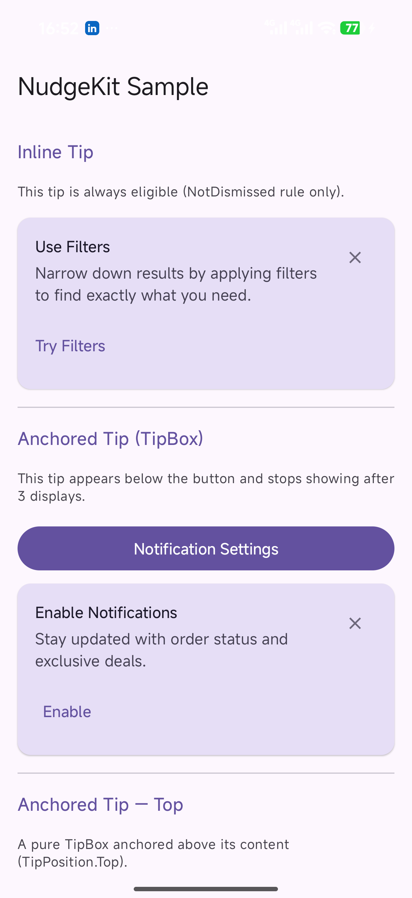
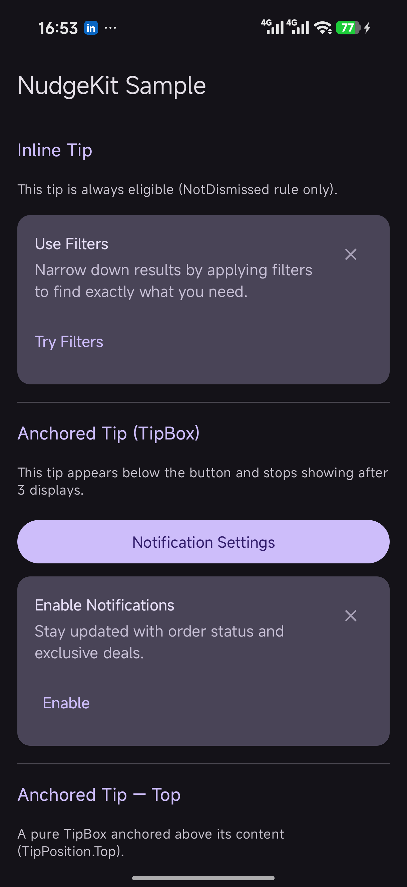
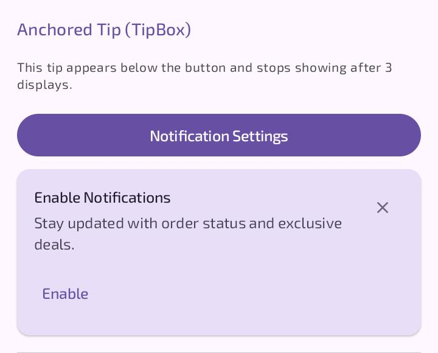
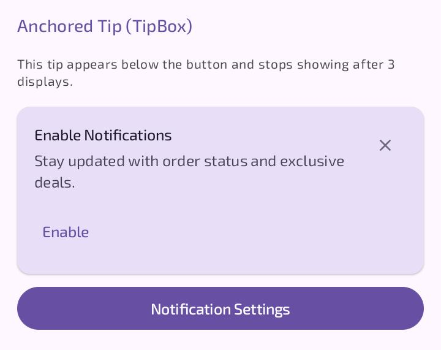

# NudgeKit

[](https://github.com/Abdullajon1881/AndroidTipKit/actions/workflows/ci.yml)

Compose-first Android tips with rules, persistence, and reusable UI.

NudgeKit is an Android library for contextual tips, feature discovery hints, and onboarding nudges. It is inspired by Apple TipKit, but built around Kotlin, Jetpack Compose, and Android app constraints.

Status:

- Feature-complete release candidate (latest: 1.0.0-rc.1)
- 200 tests passing in a correctly configured environment
- sample app included
- GitHub Actions CI configured
- local Maven publishing dry-run configured (`publishToMavenLocal`)
- not published to Maven Central yet
- Maven Central upload / signing credentials not configured yet

## Screenshots

Real captures from the bundled [`sample`](sample/) app on an Android device.

| | Light | Dark |
|---|---|---|
| **Overview** (inline tip + anchored tip) |  |  |
| **Anchored TipBox** |  |  |

## Why NudgeKit

Android apps often end up with:

- one-off tooltip UI
- scattered SharedPreferences flags
- ad hoc event counters
- custom "show once" logic
- dismissal state that is hard to reason about

NudgeKit provides one small library surface for those concerns:

- `nudgekit-core`: Android-free rule engine and models
- `nudgekit-datastore`: DataStore-backed persistence and evaluation helpers
- `nudgekit-compose`: pure Compose UI components (`InlineTip`, `TipBox`) — no DataStore dependency
- `nudgekit-compose-datastore`: state-aware managed components (`ManagedInlineTip`, `ManagedTipBox`)
- `sample`: a demo app exercising the full library

## Quick Example

```kotlin
private val checkoutTip = Tip(
    id = "save_address",
    title = "Save your address",
    message = "Save your delivery address for faster checkout next time.",
    actionLabel = "Add address",
    rules = listOf(
        TipRule.NotDismissed,
        TipRule.AfterScreenVisits("checkout", 2),
        TipRule.MaxDisplayCount(1),
    ),
)

class MainActivity : ComponentActivity() {
    private val tipManager by lazy { DataStoreTipManager.create(applicationContext) }

    override fun onCreate(savedInstanceState: Bundle?) {
        super.onCreate(savedInstanceState)
        setContent {
            MaterialTheme {
                ManagedInlineTip(
                    tip = checkoutTip,
                    manager = tipManager,
                    modifier = Modifier.fillMaxWidth(),
                    onActionClick = { /* open address flow */ },
                )
            }
        }
    }
}
```

## Installation

NudgeKit is not published yet.

Planned future coordinates:

```kotlin
implementation("io.github.abdullajon1881:nudgekit-core:<version>")
implementation("io.github.abdullajon1881:nudgekit-datastore:<version>")
implementation("io.github.abdullajon1881:nudgekit-compose:<version>")            // pure UI
implementation("io.github.abdullajon1881:nudgekit-compose-datastore:<version>")  // managed components
```

For now, use the modules locally in a multi-module Gradle build:

```kotlin
// settings.gradle.kts
include(":nudgekit-core")
include(":nudgekit-datastore")
include(":nudgekit-compose")
include(":nudgekit-compose-datastore")

project(":nudgekit-core").projectDir = file("../NudgeKit/nudgekit-core")
project(":nudgekit-datastore").projectDir = file("../NudgeKit/nudgekit-datastore")
project(":nudgekit-compose").projectDir = file("../NudgeKit/nudgekit-compose")
project(":nudgekit-compose-datastore").projectDir = file("../NudgeKit/nudgekit-compose-datastore")
```

```kotlin
// app/build.gradle.kts
dependencies {
    // Pure UI only (InlineTip, TipBox) — does not pull in DataStore:
    implementation(project(":nudgekit-compose"))

    // Managed components (ManagedInlineTip, ManagedTipBox) — transitively
    // pulls in nudgekit-compose, nudgekit-datastore, and nudgekit-core:
    implementation(project(":nudgekit-compose-datastore"))
}
```

Requirements:

- Android minSdk 24
- Kotlin 2.1.0
- Java 17
- Compose BOM `2024.12.01`

Build with JDK 17. This repo has previously failed when launched with Java 25 instead of Java 17.

## Quick Start

### 1. Create one shared `DataStoreTipManager`

```kotlin
class MyApp : Application() {
    val tipManager by lazy { DataStoreTipManager.create(this) }
}
```

### 2. Define a `Tip`

```kotlin
val favoritesTip = Tip(
    id = "favorites_tip",
    title = "Save favorites",
    message = "Tap the heart icon to save items for later.",
    actionLabel = "Try it",
    rules = listOf(
        TipRule.NotDismissed,
        TipRule.AfterEvent("item_viewed", 3),
        TipRule.MaxDisplayCount(1),
    ),
)
```

### 3. Show it with `ManagedInlineTip`

```kotlin
@Composable
fun ProductScreen(manager: DataStoreTipManager) {
    ManagedInlineTip(
        tip = favoritesTip,
        manager = manager,
        modifier = Modifier.fillMaxWidth(),
        onActionClick = { /* navigate or trigger UI */ },
    )
}
```

### 4. Track screens and events

```kotlin
LaunchedEffect(Unit) {
    manager.trackScreen("product")
}

scope.launch {
    manager.trackEvent("item_viewed")
}
```

## Core Concepts

- `Tip`: immutable value object with `id`, `title`, `message`, optional `actionLabel`, optional `priority`, optional `groupId`, and a list of `TipRule`
- `TipRule`: built-in rules include `NotDismissed`, `Once`, `MaxDisplayCount`, `AfterEvent`, `AfterScreenVisits`, `MinIntervalHours`, `ExpiresAt`, `ExpiresAfter`, `AnyOf`/`AllOf` (OR/AND), and `Custom`
- Mutual exclusion: give tips a shared `groupId` and use `manager.selectEligible(group)` (or `TipEvaluator.select`) to show only the highest-`priority` eligible tip
- `TipState`: per-tip dismissed state, display count, and last shown timestamp
- `TipCounters`: app-wide event counts and screen visit counts
- `TipManager`: write-side lifecycle interface
- `ReactiveTipManager`: `TipManager` + reactive reads (`observeTipState`, `observeCounters`) + `shouldShow`; the contract the managed UI depends on
- `DataStoreTipManager`: Android DataStore implementation of `ReactiveTipManager` plus evaluation helpers
- `MemoryTipManager`: in-memory `ReactiveTipManager` in `nudgekit-core` for tests, previews, and sample/debug flows (no Android, nothing persisted) — can drive the managed components directly
- Managed UI: `ManagedInlineTip` and `ManagedTipBox` (accept any `ReactiveTipManager`)
- `TipAnalytics`: SDK-agnostic hook for observing tip lifecycle events (`onTipShown`, `onTipDismissed`, `onTipActionClicked`)

## Tip groups (show only one)

Give competing tips a shared `groupId` and a `priority`, then let the selector pick the single highest-priority eligible one. Higher `priority` wins; ties break by `id`.

```kotlin
val homeTips = listOf(
    Tip(id = "filters",    title = "Filters",    message = "...", priority = 10, groupId = "home"),
    Tip(id = "favorites",  title = "Favorites",  message = "...", priority = 5,  groupId = "home"),
)

// Returns the one tip to show right now, or null if none are eligible.
val winner: Tip? = manager.selectEligible(homeTips)
winner?.let { InlineTip(tip = it, onDismiss = { /* manager.dismiss(it.id) */ } ) }
```

For a full per-candidate breakdown (each tip's `TipHideReason`), use `TipEvaluator.select(...)`. See [docs/core-concepts.md](docs/core-concepts.md#selecting-one-tip-from-a-group).

## Analytics

NudgeKit bundles **no** analytics SDK and makes **no** network calls. Instead it
exposes a tiny SDK-agnostic interface in `nudgekit-core`:

```kotlin
interface TipAnalytics {
    fun onTipShown(tip: Tip) {}
    fun onTipDismissed(tip: Tip) {}
    fun onTipActionClicked(tip: Tip) {}
}

object NoOpTipAnalytics : TipAnalytics
```

Implement it to forward events to whatever you already use — Firebase,
Mixpanel, Amplitude, a logger — then pass it to a managed component:

```kotlin
class MyTipAnalytics(private val tracker: Tracker) : TipAnalytics {
    override fun onTipShown(tip: Tip) = tracker.log("tip_shown", tip.id)
    override fun onTipDismissed(tip: Tip) = tracker.log("tip_dismissed", tip.id)
    override fun onTipActionClicked(tip: Tip) = tracker.log("tip_action", tip.id)
}

ManagedInlineTip(
    tip = favoritesTip,
    manager = manager,
    analytics = MyTipAnalytics(tracker),
    onActionClick = { /* … */ },
)
```

Events fire once per real user-facing action: `onTipShown` in lock-step with
`markShown` (not on every recomposition), `onTipDismissed` on dismiss, and
`onTipActionClicked` on the action button. The default is `NoOpTipAnalytics`,
so analytics is strictly opt-in. Pure UI components (`InlineTip`, `TipBox`)
stay callback-based — bridge their callbacks to analytics yourself if needed.

## Examples

### InlineTip

```kotlin
InlineTip(
    tip = Tip(
        id = "filters",
        title = "Use filters",
        message = "Filter results to find items faster.",
        actionLabel = "Open filters",
    ),
    modifier = Modifier.fillMaxWidth(),
    onDismiss = { /* hide locally */ },
    onActionClick = { /* open filters */ },
)
```

### TipBox

```kotlin
TipBox(
    tip = Tip(
        id = "notifications",
        title = "Enable notifications",
        message = "Get updates for important activity.",
        actionLabel = "Enable",
    ),
    visible = true,
    position = TipPosition.Bottom,
    onDismiss = { /* hide it */ },
    onActionClick = { /* open settings */ },
) {
    Button(onClick = {}) {
        Text("Notification settings")
    }
}
```

### Event-driven tip

```kotlin
val reviewTip = Tip(
    id = "review_tip",
    title = "Leave a review",
    message = "You have viewed several items. Tell us what you think.",
    rules = listOf(
        TipRule.NotDismissed,
        TipRule.AfterEvent("item_viewed", 3),
        TipRule.MaxDisplayCount(1),
    ),
)
```

### Screen-visit tip

```kotlin
val checkoutTip = Tip(
    id = "checkout_tip",
    title = "Save your address",
    message = "Save your address to speed up checkout.",
    rules = listOf(
        TipRule.NotDismissed,
        TipRule.AfterScreenVisits("checkout", 2),
    ),
)
```

### Reset tips

```kotlin
scope.launch {
    manager.reset("checkout_tip")
    manager.resetAll()
}
```

## Why Not Just TooltipBox?

`TooltipBox` is a UI primitive. NudgeKit adds the behavior layer:

- eligibility rules
- dismissal state
- display counts
- event thresholds
- screen-visit thresholds
- interval rules
- persistence across restarts

If you only need a tooltip, use a tooltip. If you need "show the right nudge at the right time and remember what happened", use NudgeKit.

## Current Limitations

- **Release-candidate API** — frozen for the 1.0 line; additive changes only before final `1.0.0` (see [API stability](docs/limitations.md#api-stability)).
- Not published to Maven Central yet — a local publishing dry-run (sources + Dokka javadoc + gated signing) is configured; use the modules locally for now.
- managed components (`ManagedInlineTip`, `ManagedTipBox`) live in `nudgekit-compose-datastore`; `nudgekit-compose` is pure UI with no DataStore dependency.
- managed components observe all counters through `observeCounters()` (intentional — `TipRule.Custom` can read any counter).
- `TipBox` is in-flow, not a floating overlay/popover.
- production apps should reuse the process-wide `DataStoreTipManager` from `create()`.

## Accessibility

The tip components ship with sensible accessibility defaults: the dismiss button keeps the Material 48 dp touch target with a `"Dismiss tip"` content description, the tip title is exposed as a heading for screen-reader navigation, text scales with the user's font-size setting, and the action button uses standard `TextButton` semantics. See [docs/compose-ui.md#accessibility](docs/compose-ui.md#accessibility).

## Roadmap

Done in `1.0.0-rc.1`: tip groups / mutual exclusion (`Tip.priority` is now meaningful), time-bounded rules (`ExpiresAt` / `ExpiresAfter`), and OR/AND combinators (`AnyOf` / `AllOf`).

Near-term priorities (post-1.0):

- deeper accessibility audit (TalkBack focus order, dynamic-type stress, measured contrast)
- improve `TipBox` anchoring toward a true popover; animation customization
- automatic group coordination in the managed components (`ManagedTipGroup`)
- prepare Maven Central publishing (real GPG key + Sonatype account)

## Documentation

- [Getting started](docs/getting-started.md)
- [Core concepts](docs/core-concepts.md)
- [Rules](docs/rules.md)
- [DataStore manager](docs/datastore.md)
- [Compose UI](docs/compose-ui.md)
- [Sample app](docs/sample-app.md)
- [Limitations](docs/limitations.md)
- [Roadmap](docs/roadmap.md)

## Contributing

Contributions are welcome, especially around API review, Compose UI polish, tests, and documentation improvements.

- Read [CONTRIBUTING.md](CONTRIBUTING.md) for setup, build commands, and the PR workflow.
- Bug reports and feature requests use the [issue templates](.github/ISSUE_TEMPLATE/).
- Security issues should follow [SECURITY.md](SECURITY.md) — please do not file them as public issues.
- All participants are expected to follow the [Code of Conduct](CODE_OF_CONDUCT.md).

## License

NudgeKit is licensed under the Apache License 2.0. See [LICENSE](LICENSE).
